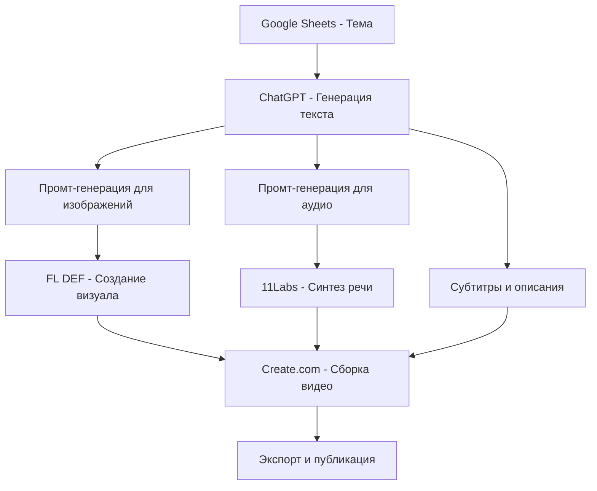

# Контент-Завод: Оптимальная Система Автоматизированной Генерации Видео

## 🎯 Главная Идея

**Основная концепция контент-завода** - создание полностью автоматизированной системы, которая генерирует вирусные видео (reels) без участия человека на каждом этапе производства, от идеи до публикации.

### Ключевые Принципы (по авторам 1 и 2):

**Подход автора 1 (Кирилл Безиков):**
- Автоматизация маркетинга и контент-маркетинга через ИИ
- Анализ конкурентов для поиска вирусного контента
- Создание реалистичных аватаров для видео
- Фокус на качество и охваты при минимальных вложениях

**Подход автора 2 (технический реализатор):**
- Техническая архитектура через N8N workflow
- Интеграция множества сервисов (Google Sheets, ChatGPT, FL DEF, 11Labs)
- Полная автоматизация процесса создания видео
- Масштабируемость и воспроизводимость

## 🏭 Архитектура Оптимального Контент-Завода

### 1. **Система Ввода (Input Layer)**
```
Google Sheets/Tables → Темы для видео
├── Тема ролика
├── Целевая аудитория  
├── Ключевые сообщения
└── Временные рамки
```

### 2. **Система Генерации Контента (Content Generation Layer)**

#### 2.1 Генерация Текста
- **ChatGPT/GPT-4** для создания сценариев
- **Промт-инженерия**: экспертный копирайтер → вдохновляющий, душевный контент
- **Форматы**: короткие реils, истории, обучающий контент

#### 2.2 Генерация Визуала
- **FL DEF** для создания изображений
- **Промт-генерация** для каждого слайда/кадра
- **Контроль качества** и перегенерация при ошибках

#### 2.3 Генерация Аудио
- **11Labs** для синтеза речи
- **Музыкальное сопровождение** из библиотеки
- **Звуковые эффекты** и переходы

### 3. **Система Сборки (Assembly Layer)**
```
Create.com/Video Editing AI
├── Компоновка видео
├── Синхронизация аудио/видео
├── Добавление субтитров
├── Применение стилей и эффектов
└── Экспорт в нужном формате
```

### 4. **Система Публикации (Publishing Layer)**
- **Автоматическая загрузка** на платформы
- **SEO-оптимизация** описаний и хештегов
- **Планирование публикаций**
- **Мониторинг производительности**

## ⚙️ Техническая Реализация

### Workflow через N8N (или аналог):



### Интеграции:
- **Google Workspace**: для управления контентом
- **ChatGPT API**: для генерации текста
- **FL DEF**: для создания изображений
- **11Labs**: для синтеза речи
- **Create.com**: для видеомонтажа
- **Платформы публикации**: Instagram, TikTok, YouTube Shorts

## 🎨 Контент-Форматы

### 1. **Слайд-шоу с титрами**
- Простая анимация текста
- Фоновая музыка
- Статистика и факты

### 2. **Истории с аватаром**
- Реалистичные ИИ-аватары
- Озвучивание текста
- Жесты и мимика

### 3. **Обучающие видео**
- Пошаговые инструкции
- Визуальные демонстрации
- Интерактивные элементы

### 4. **Новостные сводки**
- Актуальная информация
- Быстрая генерация
- Мультиязычность

## 📊 Бизнес-Модель

### Себестоимость (месячная):
- **ChatGPT API**: $20-50
- **FL DEF**: $20-40  
- **11Labs**: $22-99
- **Create.com**: $20-50
- **N8N**: $20-50 (облако)
- **Домен и сервер**: $10-30

**Итого**: $112-319/месяц

### Потенциальная экономия:
- **Время контент-менеджера**: 40-60 часов/месяц
- **Стоимость работы специалиста**: 100,000-150,000 руб/месяц
- **ROI**: 300-500% при правильной настройке

## 🚀 Этапы Разработки Прототипа

### Этап 1 (1-2 недели): MVP
1. Настройка базового N8N workflow
2. Интеграция ChatGPT для генерации текста
3. Создание простых слайд-шоу
4. Ручная публикация тестовых видео

### Этап 2 (2-3 недели): Визуализация
1. Интеграция FL DEF для изображений
2. Создание шаблонов визуального стиля
3. Автоматизация сборки в Create.com

### Этап 3 (1-2 недели): Аудио
1. Подключение 11Labs для синтеза речи
2. Создание библиотеки голосов
3. Настройка музыкального сопровождения

### Этап 4 (1 неделя): Автоматизация
1. Полная автоматизация workflow
2. Система планирования публикаций
3. Мониторинг и аналитика

## 💡 Ключевые Преимущества

### Для Бизнеса:
- **Снижение затрат** на контент-производство
- **Увеличение частоты публикаций**
- **Стандартизация качества**
- **Масштабируемость на разные языки и рынки**

### Для Контент-Менеджеров:
- **Освобождение времени** для стратегических задач
- **Фокус на аналитику** и оптимизацию
- **Работа с результатами**, а не с процессом
- **Возможность управлять несколькими аккаунтами**

## 🔧 Технические Требования

### Минимальные:
- Базовые навыки работы с API
- Понимание промт-инженерии
- Знание основ видеопроизводства

### Желательные:
- Опыт работы с N8N или Make.com
- Понимание принципов автоматизации
- Навыки оптимизации workflow

## 📈 Метрики Успеха

### Технические:
- Время генерации видео: < 10 минут
- Процент успешных генераций: > 95%
- Качество финального видео: 8+/10

### Бизнес-метрики:
- Увеличение охватов: +200-500%
- Снижение времени на производство: -80%
- Рост частоты публикаций: +300%

---

## 🎯 Заключение

Контент-завод представляет собой революционный подход к созданию видеоконтента, где человеческий фактор минимизирован, а качество и скорость производства максимизированы. При правильной реализации эта система может стать конкурентным преимуществом в современном цифровом маркетинге.

**Следующие шаги:**
1. Создание технического задания
2. Выбор и настройка инструментов
3. Разработка MVP-версии
4. Тестирование и оптимизация
5. Масштабирование на полную мощность